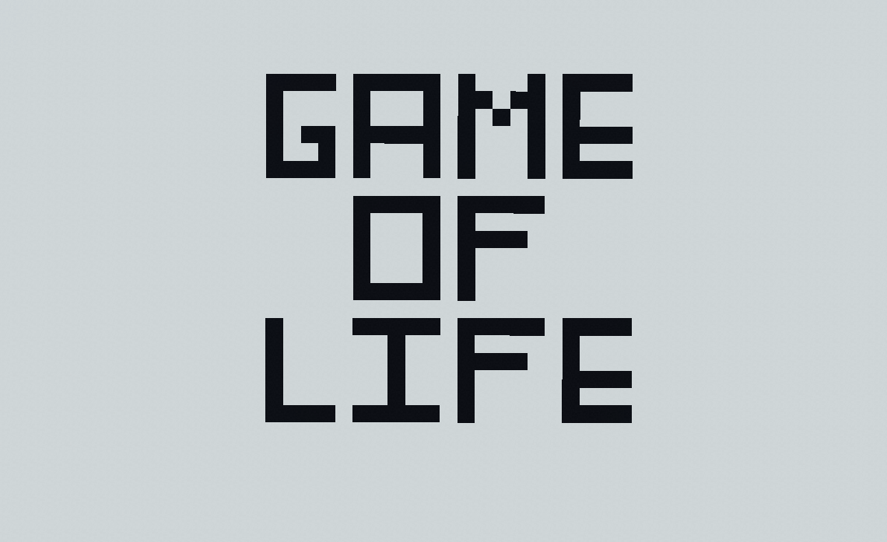
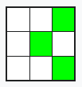
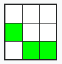
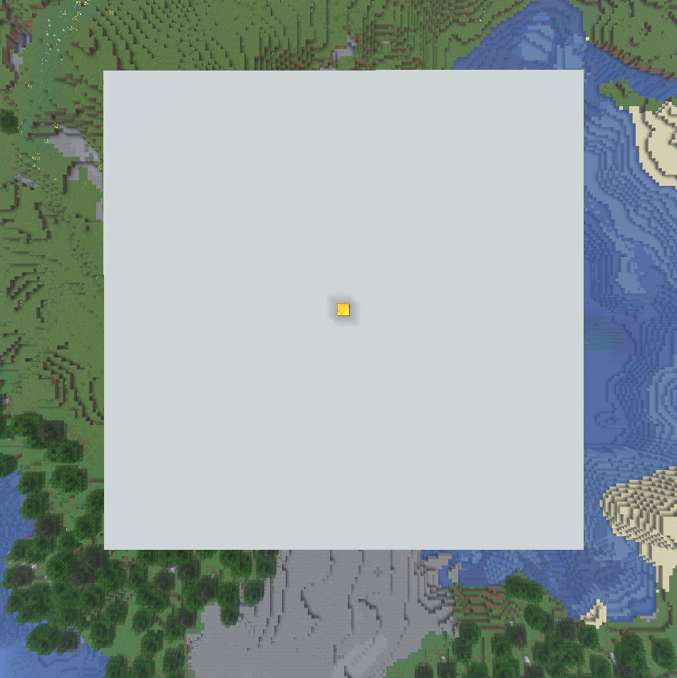
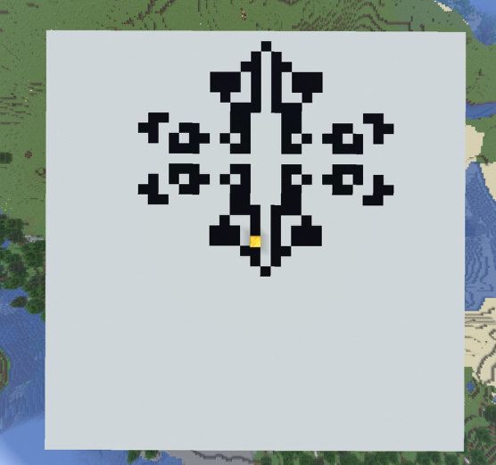

# Conway´s Game of Life - Minecraft Plugin

This Minecraft plugin for Paper is a simple recreation of the math game “Conway's Game of Life” from 1970. The straightforward implementation in Minecraft makes it fairly easy to understand and use, since both games are grid-based, can be modified with computer code, and the pixels of the original game are rendered very well. It doesn't take much to figure out how to play the game.

## What is Conway´s Game of Life? [Wikipedia](https://en.wikipedia.org/wiki/Conway%27s_Game_of_Life)

The Game of Life, also known as Conway's Game of Life is a cellular automaton devised by the British mathematician John Horton Conway in 1970. It is a zero-player game, meaning that its evolution is determined by its initial state, requiring no further input. One interacts with the Game of Life by creating an initial configuration and observing how it evolves in discrete time steps called generations. There is no limit to the number of generations or win condition.

### How to Play? 🕹️

The Game of Life is played on an infinite square grid, with each cell being in one of two states: live or dead. Cells in configurations called patterns evolve over generations according to the number of live and dead cells in their Moore neighborhood, that is, the eight cells in their immediate proximity.

### What rules determine how the game is played? 📋

|  Rule  |                                           Description                                            |                     Example                     |
|:------:|:------------------------------------------------------------------------------------------------:|:-----------------------------------------------:|
| **#1** | A living cell survives into the next generation if it has either two or three living neighbors.  |  |
| **#2** | A dead cell “is born” (lives into the next generation) if it has exactly three living neighbors. |  |

## How does it work in Minecraft? ⛏️

The plugin implements the logic, user input, and user controls in Minecraft. The user uses two commands to do this.

|      Command      |                                                                                                                                                                                                                                                                                                            Description                                                                                                                                                                                                                                                                                                             |                           Example                           |
|:-----------------:|:----------------------------------------------------------------------------------------------------------------------------------------------------------------------------------------------------------------------------------------------------------------------------------------------------------------------------------------------------------------------------------------------------------------------------------------------------------------------------------------------------------------------------------------------------------------------------------------------------------------------------------:|:-----------------------------------------------------------:|
|   **`/canvas`**   |                                                                                                                                                                               You can use this command to create a canvas. You can set the center, the material of the cells and the canvas, and the size. You can also place it, delete it, or clear it afterward. When placing it, a gold block is placed in the center to help with orientation.                                                                                                                                                                                |      |
| **`/simulation`** | You can use this command to simulate the game. After placing a canvas, you can now build a starter figure on the 2D grid using the predefined material (default: minecraft:black_concrete). Just replace the canvas blocks, don’t worry, this won’t break anything. To view the generations one by one, you can do this manually, step by step. However, a built-in scheduler is also available to simulate the process for you. You can start or stop it, or adjust its speed. If you want more detailed information about the simulation, you can view debug information either in the action bar or in more detail in the chat. |  |
|   **`/reset`**    |                                                                                                                                                                                                                                                                  Simply put, you can use this command to reset either the canvas, the simulation, or everything.                                                                                                                                                                                                                                                                   |                                                             |

If you enter the command without any additional parameters, the syntax for using it in chat will be displayed.

### Rule types
The standard game is played according to the two rules listed above. However, I discovered that there are two other sets of rules that can be used to simulate the game. This is known as "Copyworld", in which the following rules apply.

|      Rule      |                                 Description                                  |
|:--------------:|:----------------------------------------------------------------------------:|
| **Death Rule** | A cell with exactly 0, 2, 4, 6, or 8 living neighbors dies (or remains dead) |
| **Born Rule**  |        1, 3, 5, or 7 live neighbors create (or maintain) a live cell         |

With these two settings, a built shape will repeat itself indefinitely as it expands.

To toggle this, use `/simulation ruletype copyworld`; to revert, simply use `/simulation ruletype standard`.

### Important Notes ❗

- It is not recommended to generate a canvas that is too large. For example, more than 300 blocks, as this places an exponential load on server performance.
- When cell generation extends beyond the edge, the opposite side of the canvas is used for further simulation. Simply put, when a pattern moves off the canvas, it reappears on the other side. This makes it appear infinite.

## Saved Data 📃

- As soon as the server is shut down normally, all settings that have been configured are saved. This means that after restarting, the game can continue as usual without any problems.
- The saved data is stored in a .yml file located in a folder named after the plugin, within the plugins folder.

### Installation 📲
* Download the plugin `ConwaysGameOfLifePlugin-1.0.jar` in `Release-1.0` or at [CurseForge](https://www.curseforge.com/minecraft/bukkit-plugins/conway-s-game-of-life)
* Place it in your server's plugins folder
* Restart the server
* The plugin will automatically load

## Note ✍️
- This plugin was created by KeineAhnungLeo and is open source.
- The plugin will may continue to receive some updates and bugfixes in the future.